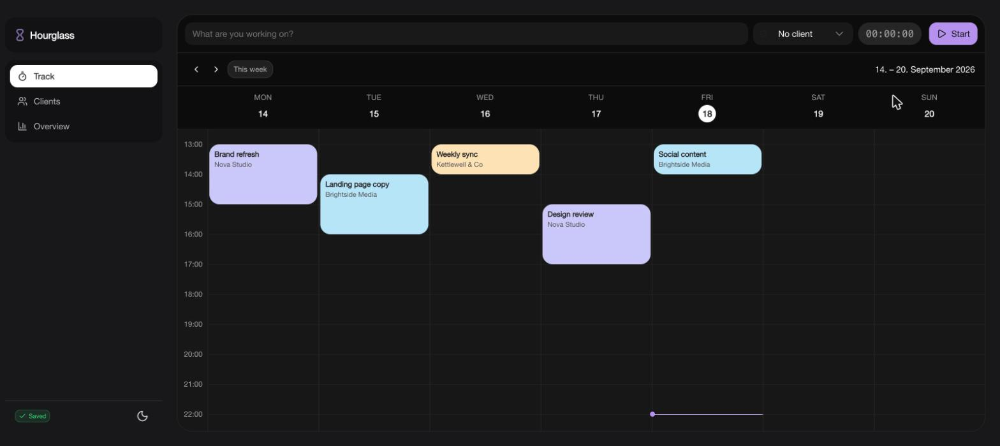

# Hourglass

A local, single-user time tracker for freelancers — a Toggl Track replacement that runs entirely in the browser. There is no backend, no login, and no cloud database: every client, project entry, and timer lives in a single SQLite file on your own computer.



## Quick start — just try it

**[Open the live demo](https://timwriter.github.io/hourglass/)** — runs entirely in your browser, nothing to install. Click "Create new database file" and pick anywhere on disk to try it with real data (or throw the file away afterwards).

Prefer not to use a hosted page at all? **[Download hourglass.html](https://github.com/TimWriter/hourglass/releases/latest/download/hourglass.html)** and open it directly — no server, no Node, no install. It's a single file, rebuilt automatically from `main` on every push (see [Offline, no-server build](#offline-no-server-build) below for how that works).

Built with [Nuxt](https://nuxt.com), [Nuxt UI v4](https://ui.nuxt.com), [sql.js](https://sql.js.org) (SQLite compiled to WebAssembly) and the browser's [File System Access API](https://developer.mozilla.org/en-US/docs/Web/API/File_System_API).

The visual style (Outfit font, purple accent, dark floating nav bar, pastel calendar entries, generous rounded corners) is modeled after the moodboard in `reference/`. The whole radius scale is driven by the single `--ui-radius` token in `app/assets/css/main.css`, and the primary color is a custom purple scale defined there too.

## Requirements

- **Chrome or Edge** (or another Chromium-based browser). The File System Access API that this app relies on for local file persistence is not implemented in Firefox or Safari — the app detects this on startup and shows a clear message instead of failing silently.
- Node.js + [pnpm](https://pnpm.io) (the repo pins `pnpm@12.4.1` via `packageManager` / Corepack).

## Setup

```bash
pnpm install
```

## Development

```bash
pnpm dev
```

Open the printed `http://localhost:3000` URL in Chrome or Edge.

## Production

```bash
pnpm build
pnpm preview
```

The app is fully client-side (`ssr: false`), so the production build is a static SPA — it can be hosted on any static file host.

### Offline, no-server build

```bash
pnpm build:offline
```

This produces a single self-contained file at `.output/offline/hourglass.html` that you can open directly from disk (double-click it, or drag it into a browser) — no server, no Node, nothing to host. It's a normal `nuxt generate` output, but `scripts/pack-offline.mjs` then inlines the JS bundle, CSS, fonts, logo, and the sql.js WebAssembly binary directly into that one HTML file as `data:` URIs, and routing uses hash mode (`#/track` instead of `/track`). This is necessary because Chrome refuses to load ES module `<script src>` tags or make any `fetch()` request for a local file from a `file://` page, and history-mode routing can't resolve real sub-paths without a server.

Re-run `pnpm build:offline` any time the app changes — it's not kept in sync automatically.

## Connecting the database file

On first launch you'll see a **"Connect your database file"** screen:

- **Create new database file** opens your browser's native "Save As" dialog. Pick a location (e.g. a `data/` folder inside this project, or anywhere else you like) and a filename such as `hourglass.sqlite`. A new, empty database with the right schema is created there.
- **Open existing file** lets you reconnect a `.sqlite` file created earlier by this app.

The app remembers a reference to that file (via IndexedDB) so it reconnects automatically the next time you open the page — Chrome only needs to re-ask for permission if you restart the browser, in which case a **"Reconnect database"** button appears (browsers require a real click to re-grant file access, so this can't happen fully automatically).

Every change (starting/stopping a timer, editing an entry, adding a client, …) is written back to that `.sqlite` file after a short debounce, and also flushed immediately when you switch tabs or close the page. A small badge in the top-right corner shows **Saved / Saving… / Save failed** at all times.

Because the data lives in one ordinary file, you can back it up, sync it with your own tools (e.g. a synced folder), or open it with any SQLite browser to inspect it directly.

## Features

- **Clients** — name, hourly rate, color, archive instead of delete once a client has time entries.
- **Track** — a Toggl-style timer bar (title, client, start/stop) plus a weekly calendar. Entries can be created by clicking and dragging on empty time, moved by dragging, resized from either edge (snapping granularity is configurable in Settings), and edited or deleted via a click. A timer left running is automatically stopped and flagged for review after a configurable number of hours (default 24, can be turned off).
- **Overview** — hours this week/month (optionally filtered by client), a linear revenue forecast for the current month based on elapsed vs. total Mon–Fri workdays, and a billing calculator that computes hours/revenue per day for a chosen client and date range (This week / This month / Last month presets, or a custom range). Billing is calculated live from time entries; nothing is marked as "invoiced" or persisted separately.
- **Settings** — time format (12/24h), first day of the week, currency, date format, calendar snapping granularity, default page on launch, auto-stop threshold, the billing table's daily rounding step, and switching to a different (or a brand-new) database file without leaving the app. All of it is stored as JSON in the same SQLite file's `meta` table, so it travels with the database rather than living in browser storage — switching files means the new file's own settings apply, not the ones you just set.

## Project structure

```
app/
  composables/   useDatabase (sql.js + file persistence), useClients, useTimeEntries, useSettings, useNow
  components/    SetupScreen, WeekCalendar, TimerBar, ClientFormModal, EntryEditModal, ...
  pages/         track.vue, clients.vue, overview.vue, settings.vue
  utils/         format.ts, week.ts, stats.ts
scripts/
  pack-offline.mjs   packs `nuxt generate`'s output into the single-file offline build
```

## Assumptions made beyond the original spec

- **Nuxt UI v4 instead of v3.** The project had Nuxt UI `^4.11.1` already installed, so the app was built against the v4 component API (the v3-era patterns referenced in the original brief no longer apply — e.g. `UPopover`/`UModal` use `v-model:open` and named slots rather than the old `v-model` + default-slot style).
- **Drag interactions are constrained to a single day column.** Dragging to create, move, or resize a calendar entry only reads the pointer's vertical position; moving the pointer into a neighbouring day's column does not move the entry to that day (multi-day entries — e.g. a 24h auto-stopped timer that crosses midnight — can only be corrected via the edit modal, not by dragging).
- **Snapping granularity defaults to 15 minutes** for drag-to-create, drag-to-move, and drag-to-resize, but is now configurable (5/15/30 min) in Settings.
- **The 12/24-hour and date-format settings only affect text the app renders itself** (calendar hour labels, the billing table's date column, the date-picker button). The native `<input type="time">`/`<input type="date">` fields used elsewhere (entry start/end, billing range) are rendered by the browser according to its own locale and can't be overridden from JS in a cross-browser way.
- **Editing an entry's client re-snapshots the hourly rate** to that client's _current_ rate, unless the rate field itself is edited directly in the same change — this keeps `rate_snapshot` meaningful after reassigning an entry to a different client while still allowing a manual override.
- **The overview's client filter also scopes the revenue forecast**, not just the two hour tiles, since it lives in the same "Stats" area.
- **Remembering the file handle in IndexedDB is best-effort.** If that write fails (e.g. private browsing with IndexedDB disabled), the freshly opened/created database still loads and works for the current session — you'd just be asked to pick the file again next time instead of the app being blocked entirely.
- **A running (or multi-day) calendar entry can't be dragged**, only clicked to open the edit modal — resizing/moving a still-open-ended entry isn't a meaningful operation, and the edit modal already lets you set an end time (which also stops the timer) or correct the start time.
- **Routing uses hash mode** (`app/router.options.ts`) rather than history mode, so URLs look like `/#/track` instead of `/track` even when hosted normally. This was needed to support the offline single-file build (see above), where there's no server to resolve a real `/track` sub-path, and hash mode works identically either way.
